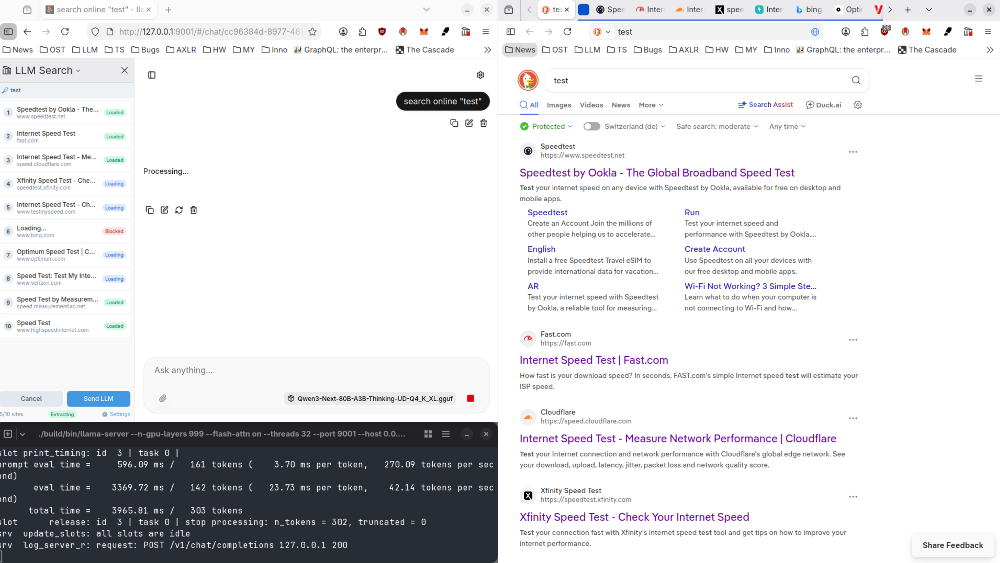
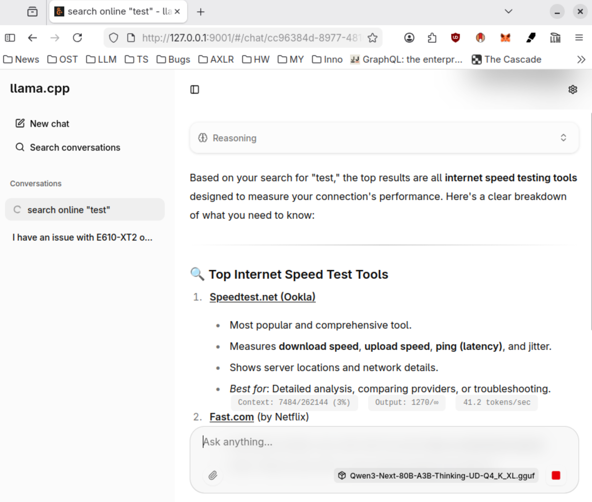
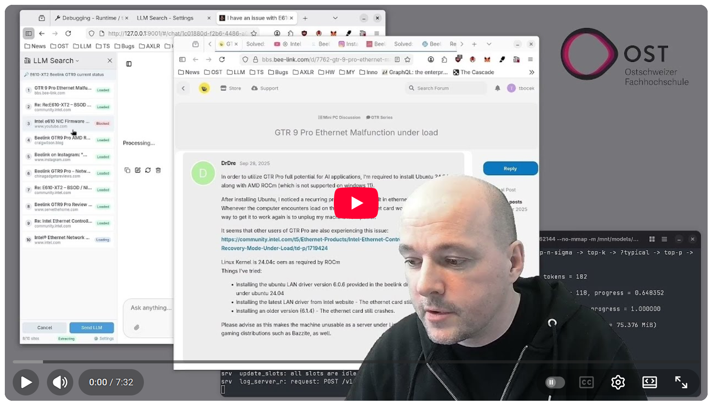

# LLM Web Search Extension - llm-local-web-search

Firefox extension (prototype) that intercepts OpenAI-compatible API calls and adds client-side web search capability.

## Motivation

Server-side web search in LLMs sometimes fails with "could not fetch" errors due to rate limiting, captchas, or blocked requests. This extension moves search to the client browser where:

- You see and solve captchas yourself
- You control which pages load
- No server-side fetching issues
- Works offline with local LLMs

Tested with [llama.cpp](https://github.com/ggml-org/llama.cpp). Other backends untested.

## How It Works

1. Extension intercepts requests to `/v1/chat/completions`
2. Injects `web_search` tool call into the request
3. When LLM calls the tool, opens DuckDuckGo in a new window
4. Extracts search results and page content via [Readability.js](https://github.com/mozilla/readability)
5. Returns results to LLM as tool response

In more detail: when a search is triggered, the extension opens a new window with DuckDuckGo. Once results load, it opens each result URL in a separate tab within that window (up to 10 tabs by default). Each tab runs the Readability extractor to pull article content. After all tabs finish loading or the timeout expires, the window closes automatically and results are sent back to the LLM.

By disabling auto-close, you can inspect what was searched. The sidebar shows an overview of all tabs and their loading status. You can click any item to switch to that tab. If a site requires a captcha or login, you can interact with it directly in the browser. If you navigate within a tab (e.g., click a link), the new page content replaces the previous one. Only the last visited page per tab is sent to the LLM, the last content wins. When ready, press the sidebar button to send results to the LLM and continue the conversation.

To use private windows, enable it in extension settings. You must also allow the extension to run in private mode: about:addons -> Extension -> Permissions -> "Run in Private Windows".

## Screenshots



The sidebar (left) shows the status for each search result. Sites are numbered 1-10 with status indicators: Loaded (green), Loading (blue), or Blocked (red). The DuckDuckGo search window (right) opens automatically and displays the original query. Each result URL opens in a separate tab where Readability.js extracts the main content. You can click any sidebar item to jump to that tab, solve captchas, or navigate manually if needed.



After extraction completes, the search window closes and results are sent back to the LLM. The model receives the extracted text content from each page and synthesizes an answer. Here, a search for "test" returned internet speed testing tools, and the LLM summarized the top results with relevant details from the actual page content.

## Demo

[](https://www.youtube.com/watch?v=K7j7BiFv178)

Click image to watch the demo on YouTube

## Installation

This extension is available from the addon page (todo)

For development:

1. Clone with `git clone https://github.com/tbocek/llm-web-search`
1. Open in Firefox `about:debugging#/runtime/this-firefox`
1. Click "Load Temporary Add-on"
1. Select `manifest.json`

Build package/zip locally:

```
npx web-ext build --source-dir ./src -a ./bin
```

## Configuration

Settings available in extension options:

| Setting | Default | Description |
|---------|---------|-------------|
| URL Patterns | `localhost`, `127.0.0.1` | Which URLs to intercept |
| Max Results | 10 | Search results to fetch (1-10) |
| Auto-close | true | Close search window when done |
| Extract Timeout | 10s | Seconds before auto-submit |
| Extract Delay | 3000ms | Wait time before extracting page content |
| Incognito Mode | false | Run searches in private windows |

## Dependencies

- [Readability.js](https://github.com/mozilla/readability) (Apache-2.0, hard-copied for protoyping)

## Acknowledgments

Built with assistance from Qwen3-next and Claude.ai.