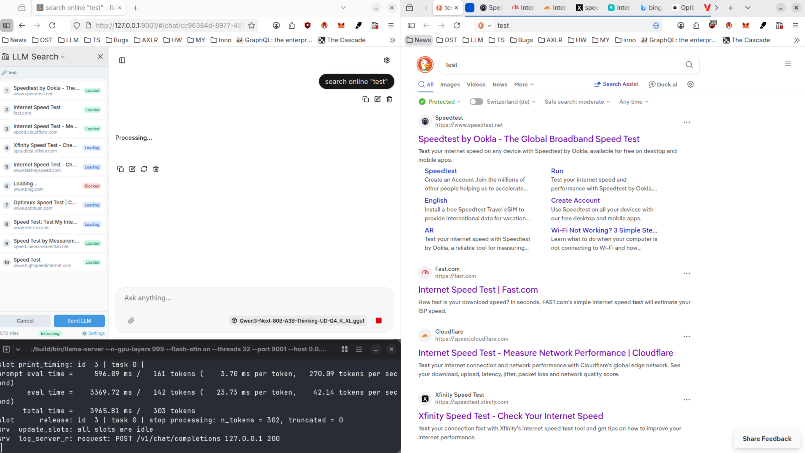
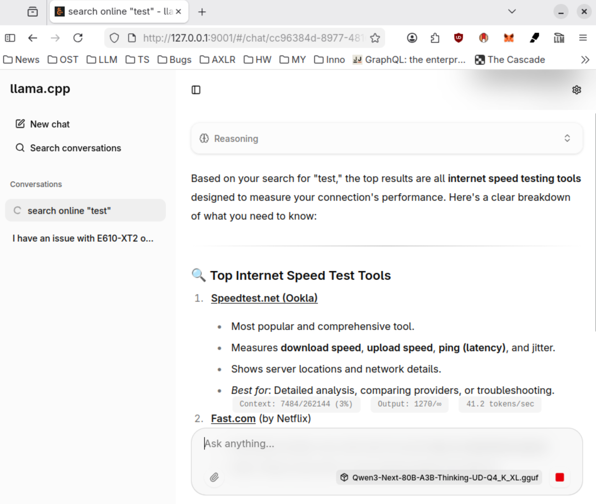
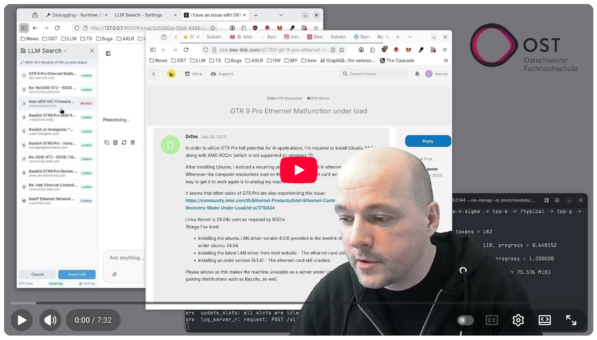

# LLM Web Search Extension - llm-local-web-search

[](https://addons.mozilla.org/addon/llm-local-web-search/)

Firefox extension that intercepts OpenAI-compatible API calls and adds client-side web search capability.

10.02.2026: Interesting news, the [WebMCP specification](https://webmachinelearning.github.io/webmcp/) is [available as an early preview for prototyping](https://developer.chrome.com/blog/webmcp-epp). WebMCP is a browser-native API that lets websites expose structured tools to AI agents via `navigator.modelContext`. Websites can register tools (with name, description, input schema, and an execute callback) that agents, browser agents, and assistive technologies can discover and invoke.

**How this relates to llm-local-web-search:** This extension currently works by intercepting `fetch()` calls to OpenAI-compatible endpoints, injecting a `client_web_search` tool definition, opening DuckDuckGo in a popup window, scraping results via content scripts, extracting page content with Readability.js, and shuttling everything back through message passing. It's effective, but it's a complex pipeline of injected scripts, content scripts, background workers, and cross-context message relays.

With WebMCP, a search engine like DuckDuckGo (or any website) could natively expose a `search` tool that an AI agent calls directly through the browser API. Content sites could expose a `getArticleContent` tool. The entire multi-window, multi-tab, scraping-and-extraction pipeline this extension implements would collapse into simple tool calls. No fetch interception, no DOM scraping, no popup windows, no content script bridges — just structured `navigator.modelContext` tool invocations.

**What still needs to happen:** WebMCP is in early preview (available to early preview program participants only) and websites need to actually adopt it. Firefox has not announced support yet. What I do not see yet: the spec is designed for a browser-level agent to consume tools, not for arbitrary web pages to discover each other's tools cross-origin.

WebMCP is a step in the right direction, but the current spec only defines how websites register tools, it doesn't address cross-site tool discovery or how an agent on one origin finds tools on another. Security considerations are not yet addressed in the spec, and getting cross-origin tool access right will be the hard part.

**Alternatives and related approaches:**
- [Anthropic's MCP](https://modelcontextprotocol.io/) — the backend-side protocol (JSON-RPC) for connecting AI to services via hosted servers. Complementary to WebMCP: MCP handles server-to-server, WebMCP handles browser-to-site.
- [Browserbase MCP Server](https://github.com/browserbase/mcp-server-browserbase) — lets LLMs control a headless browser via MCP, similar concept to this extension but server-side.
- Browser automation (Puppeteer/Playwright) — can achieve similar results but requires a headless browser instance, not client-side.

## Motivation

Server-side web search in LLMs sometimes fails with "could not fetch" errors due to rate limiting, captchas, or blocked requests. This extension moves search to the client browser where:

- You see and solve captchas yourself
- You control which pages load
- No server-side fetching issues
- Works offline with local LLMs

Tested with [llama.cpp](https://github.com/ggml-org/llama.cpp). Open WebUI does not work with this extension due to [this](https://github.com/open-webui/open-webui/issues/20548).
Other backends untested.

## How It Works

1. Extension intercepts requests to `/v1/chat/completions`
2. Injects `client_web_search` tool call into the request
3. When LLM calls the tool, opens DuckDuckGo in a new window
4. Extracts search results and page content via [Readability.js](https://github.com/mozilla/readability)
5. Returns results to LLM as tool response

In more detail: when a search is triggered, the extension opens a new window with DuckDuckGo. Once results load, it opens each result URL in a separate tab within that window (up to 10 tabs by default). Each tab runs the Readability extractor to pull article content. After all tabs finish loading or the timeout expires, the window closes automatically and results are sent back to the LLM.

By disabling auto-close, you can inspect what was searched. The sidebar shows an overview of all tabs and their loading status. You can click any item to switch to that tab. If a site requires a captcha or login, you can interact with it directly in the browser. If you navigate within a tab (e.g., click a link), the new page content replaces the previous one. Only the last visited page per tab is sent to the LLM, the last content wins. When ready, press the sidebar button to send results to the LLM and continue the conversation.

To use private windows, enable it in extension settings. You must also allow the extension to run in private mode: about:addons -> Extension -> Permissions -> "Run in Private Windows".

## Screenshots



The sidebar (left) shows the status for each search result. Sites are numbered 1-10 with status indicators: Loaded (green), Loading (blue), or Blocked (red). The DuckDuckGo search window (right) opens automatically and displays the original query. Each result URL opens in a separate tab where Readability.js extracts the main content. You can click any sidebar item to jump to that tab, solve captchas, or navigate manually if needed.



After extraction completes, the search window closes and results are sent back to the LLM. The model receives the extracted text content from each page and synthesizes an answer. Here, a search for "test" returned internet speed testing tools, and the LLM summarized the top results with relevant details from the actual page content.

## Demo

[](https://www.youtube.com/watch?v=K7j7BiFv178)

Click image to watch the demo on YouTube

## Installation

This extension is available from the [addon page](https://addons.mozilla.org/addon/llm-local-web-search/)

## Configuration

Settings available in extension options:

| Setting | Default | Description |
|---------|---------|-------------|
| URL Patterns | `localhost`, `127.0.0.1` | Which URLs to intercept |
| Max Results | 10 | Search results to fetch (1-10) |
| Extract Delay | 5000ms | Max wait time before extracting page content |
| Incognito Mode | false | Run searches in private windows |

## Dependencies

- [Readability.js](https://github.com/mozilla/readability) (Apache-2.0, hard-copied for protoyping)

## Acknowledgments

Built with assistance from Qwen3-next and Claude.ai.

## For developers

1. Clone with `git clone https://github.com/tbocek/llm-web-search`
1. Open in Firefox `about:debugging#/runtime/this-firefox`
1. Click "Load Temporary Add-on"
1. Select `manifest.json`

Build package/zip locally:

```
npx web-ext build --source-dir ./src -a ./bin
```

For a release, execute ```release.sh```, make sure everything is commited and working.